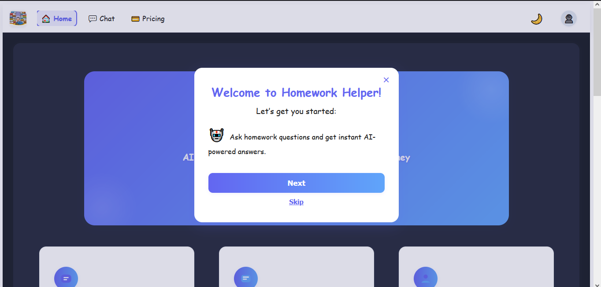
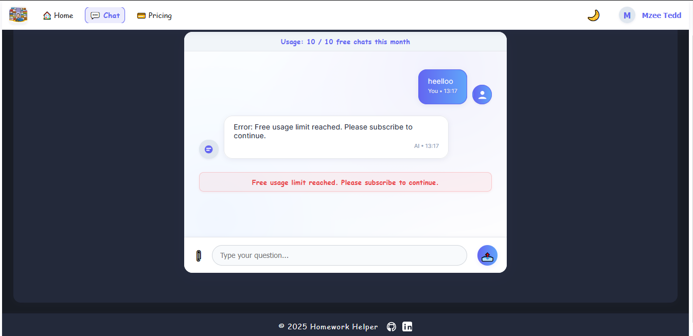

# Homework Helper for Busy Parents

[](https://eduedge.netlify.app)
[](https://homework-helper-backend.onrender.com)
[](https://ai-python-service.onrender.com)
[](LICENSE)

---

# Table of Contents
- [Overview](#overview)
- [Features](#features)
- [Live Links](#live-links)
- [Tech Stack](#tech-stack)
- [Project Structure](#project-structure)
- [Screenshots](#screenshots)
- [Mobile UX](#mobile-ux)
- [Mobile Navigation](#mobile-navigation)
- [Accessibility](#accessibility)
- [Quick Start](#quick-start)
- [Deployment](#deployment)
- [API Endpoints](#api-endpoints)
- [Environment Variables](#environment-variables)
- [Security](#security)
- [Troubleshooting](#troubleshooting)
- [Contributing](#contributing)
- [Credits](#credits)
- [License](#license)

---

## Overview
Homework Helper is a full-stack MERN application with AI-powered chat, M-Pesa subscription, and professional user profile management. It is designed to help busy parents get instant, AI-driven homework support for their children.

---

## Features
- **AI Chat:** Ask homework questions and get instant answers powered by Cohere AI (via a Python microservice).
- **M-Pesa Subscription:** Secure mobile payments for premium access using Safaricom Daraja API.
- **User Profiles:** View and edit your profile, change password, and upload an avatar.
- **Responsive UI:** Modern, mobile-friendly design with professional feedback and error handling.
- **Session Management:** Auto-logout after 5 minutes of inactivity for security. Centralized session/user state with instant UI updates.
- **Registration/Login Flow:** Registration redirects to login with a success message. After login, users are redirected to the home page.
- **Usage Tracking:** Free users have monthly usage limits, with a usage bar and warnings in the UI.
- **Image Upload & OCR:** Upload images for AI-powered text extraction and question answering.
- **Admin/Pro Features:** (Optional) Extendable for more roles and features.

---

## Live Links
- **Frontend:** [eduedge.netlify.app](https://eduedge.netlify.app)
- **Backend API:** [Render Node.js Service](https://homework-helper-backend.onrender.com)
- **AI Python Service:** [Render Python Service](https://ai-python-service.onrender.com)

---

## Tech Stack
- **Frontend:** React, Axios, Netlify
- **Backend:** Node.js, Express, MongoDB, Mongoose, Render
- **AI Service:** Python (Flask, Cohere, python-dotenv), Render
- **Payments:** M-Pesa Daraja API

---

## Project Structure
- `/server` — Node.js/Express backend (MongoDB, AI, payments, REST API)
- `/client` — React frontend (chat UI, image/question input, payments, auth)

---

## Screenshots

| Desktop | Mobile |
| ------- | ------ |
|  |  |


---

## Mobile UX
- Fully responsive: All main UI elements adapt to small screens.
- Mobile-first CSS (`client/src/mobile.css`) with extensive media queries.
- Touch-friendly buttons, cards, and modals.
- **Collapsible (hamburger) menu for navigation:**
  - On mobile, navigation is hidden by default and toggled with a hamburger icon.
  - Menu auto-expands when tapped and minimizes when a link is selected or the user taps outside.
  - Example (React):
    ```jsx
    // In Header.js or NavBar.js
    const [menuOpen, setMenuOpen] = useState(false);
    return (
      <nav className="mobile-nav">
        <button aria-label="Open menu" onClick={() => setMenuOpen(!menuOpen)}>
          <span className="hamburger-icon" />
        </button>
        <ul className={`nav-links ${menuOpen ? 'open' : ''}`}>/* ...links... */</ul>
      </nav>
    );
    ```
  - CSS ensures smooth slide-in/out and overlays the menu above content.
- Fast, accessible, and tested on real devices.

---

## Mobile Navigation
- **Hamburger menu**: Use a button with `aria-label` and a visually clear icon.
- **Auto-collapse**: Menu closes on link click or outside tap (add event listeners for UX).
- **Keyboard accessible**: Menu can be opened/closed with keyboard, links are tabbable.
- **Sample CSS**:
  ```css
  .mobile-nav .nav-links {
    display: none;
    position: absolute;
    top: 60px; left: 0; right: 0;
    background: #fff;
    box-shadow: 0 2px 8px rgba(0,0,0,0.1);
    transition: max-height 0.3s;
    max-height: 0;
    overflow: hidden;
  }
  .mobile-nav .nav-links.open {
    display: block;
    max-height: 400px;
  }
  .hamburger-icon {
    width: 30px; height: 3px; background: #333; margin: 6px 0;
    display: block;
  }
  ```

---

## Best Practices for Mobile Fit
- Add the following meta tag in `client/public/index.html` for full-screen fit:
  ```html
  <meta name="viewport" content="width=device-width, initial-scale=1, viewport-fit=cover">
  ```
- Use `height: 100vh;` and `box-sizing: border-box;` in CSS to ensure content fits the screen.
- Test on multiple devices and orientations.

---

## Accessibility
- ARIA labels on all interactive elements.
- Keyboard navigation supported (tab, enter, escape for modals).
- Sufficient color contrast and focus indicators.
- Screen reader friendly (tested with NVDA/VoiceOver).

---

## Quick Start

### 1. Local Development
- Backend: `cd server && npm install && npm run dev`
- Frontend: `cd client && npm install && npm start`
  - Registration redirects to login with a success message.
  - After login, users are redirected to the home page.
  - Users are automatically logged out after 5 minutes of inactivity.

### 2. Deployment
- Frontend: Deploy `/client` to Netlify
- Backend: Deploy `/server` to Render/Heroku

### 3. Environment Variables
- See `.env.example` files in both `/server` and `/client`

---

## Deployment

### Frontend (Netlify)
- Deploy the `client` folder to Netlify.
- Set `REACT_APP_API_URL` in Netlify environment variables to your backend Render URL.

### Backend (Render)
- Deploy the `server` folder to Render as a Node.js web service.
- Set all environment variables in the Render dashboard (see `.env`).
- Set `PYTHON_AI_URL` to your deployed Python service URL.

### Python AI Service (Render)
- Deploy the `ai-python-service` folder to Render as a Python web service.
- Set `COHERE_API_KEY` in the Render dashboard.

---

## API Endpoints

### Backend (Node.js)
- `POST /api/chat` — Ask a question (calls Python AI service)
- `POST /api/subscribe` — Start M-Pesa subscription
- `POST /api/mpesa/callback` — M-Pesa payment callback
- `GET /api/subscription/:userId` — Get subscription status
- `GET /api/user/:id` — Get user profile
- `PUT /api/user/:id` — Update user profile
- `PUT /api/user/:id/password` — Change password

### Python AI Service
- `POST /chat` — AI question/answer endpoint

---

## Environment Variables

### Backend
- `MONGO_URI`, `JWT_SECRET`, `CLIENT_URL`, `PYTHON_AI_URL`, etc.
- `MPESA_CONSUMER_KEY`, `MPESA_CONSUMER_SECRET`, `MPESA_SHORTCODE`, `MPESA_PASSKEY`, `MPESA_CALLBACK_URL`

### Python AI Service
- `COHERE_API_KEY`

---

## Security & Session Management
- Auto-logout after 5 minutes of inactivity (idle detection).
- Centralized session and user state with React Context for instant UI updates.
- Registration success message shown on login page after registering.
- After login, users are redirected to the home page.
- All secrets and API keys must be set in environment variables (never in code or public repos).
- Use HTTPS for all deployed services.

---

## Troubleshooting
- **CORS errors:** Ensure all deployed URLs are set correctly in environment variables.
- **M-Pesa sandbox issues:** Use real phone numbers and credentials for production.
- **AI service not responding:** Check Python AI service logs and `COHERE_API_KEY`.
- **Frontend not connecting:** Confirm `REACT_APP_API_URL` is set to backend Render URL.

---

## Contributing
1. Fork the repo and create a feature branch.
2. Make your changes and add tests if needed.
3. Open a pull request with a clear description.
4. All contributions are welcome!

---

## Credits
- Built by Scylla8434.
- AI powered by Cohere.
- Payments powered by Safaricom M-Pesa Daraja API.

---

## License
MIT 
